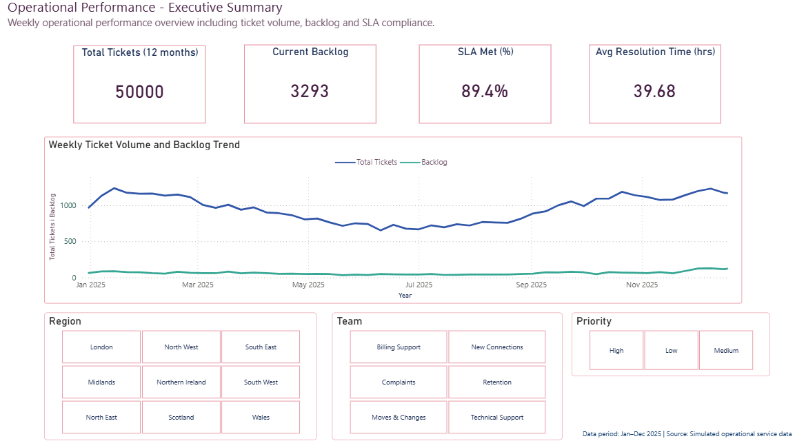
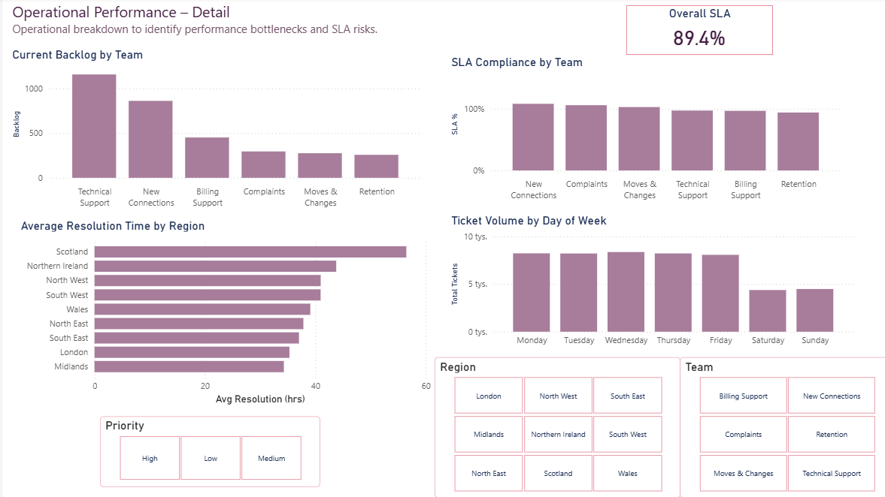

# Operational Performance & MI Reporting (Power BI)

Operational Performance & MI Reporting is a Power BI dashboard built to support operational managers in monitoring key performance indicators and improving day-to-day decision making across teams.

---

## Dashboard Preview

**Executive Summary**  


**Operational Detail**  


---

## Overview

This project focuses on creating a clear and practical MI (Management Information) dashboard to support operational performance monitoring.

The main goal was to turn raw operational data into an easy-to-use reporting tool that helps managers understand workload, backlog, SLA performance and potential risk areas.

The dashboard was designed with a strong focus on usability and business value, making sure it can be used by both technical and non-technical stakeholders.

---

## Business Requirement

Operational teams needed a simple and reliable way to track performance, identify bottlenecks and monitor SLA risks in order to support better resourcing and task prioritisation decisions.

This dashboard addresses this need by providing clear, actionable and regularly updated performance metrics.

---

## Dataset

The dataset includes operational and performance-related data such as:

- workload volumes  
- backlog levels  
- SLA compliance  
- time-based performance trends  

It reflects a realistic operational environment where regular reporting is essential for managing performance and resources.

---

## Tools & Technologies

- Power BI Desktop – data modelling, DAX measures, reports and dashboards  
- Excel – data review, validation and quick calculations  
- DAX – KPI logic (SLA %, backlog metrics, trend analysis)  
- GitHub – version control and portfolio hosting

---

## Analysis & Development Process

1. Understanding business context and key performance metrics  
2. Reviewing, cleaning and preparing the data  
3. Building the data model and DAX measures  
4. Designing a clear and intuitive dashboard layout  
5. Testing insights and validating results with business logic  

---

## Key Metrics & KPIs

- Backlog Count – number of unresolved tasks over time  
- SLA Compliance % – share of tasks completed within SLA thresholds  
- Workload Distribution – task volumes by period and category  
- Performance Trends – identification of operational changes over time  

---

## Key Insights

- Improved visibility of backlog and workload trends  
- Early identification of potential SLA risk areas  
- Better understanding of performance fluctuations  
- Support for operational planning and prioritisation  

---

## Business Value

This dashboard helps organisations to:

- monitor operational performance more effectively  
- identify risks at an early stage  
- improve resource allocation  
- communicate KPIs clearly to stakeholders  

It reflects how MI reporting is used in real UK business environments.

---

## Deliverables

- Power BI file: `Operational_Performance.pbix`  
- Dashboard screenshots  
- Project documentation (README)

---

## Repository Structure

```
/screenshots     — dashboard visuals
Operational_Performance.pbix
README.md
```


---

## Possible Future Improvements

- Extended long-term trend analysis  
- More detailed drill-through views  
- Automated data refresh pipelines  

---

## About This Project

This project is part of my portfolio as a Junior Data & Business Analyst, focused on practical MI reporting and decision support using Power BI and Excel.


